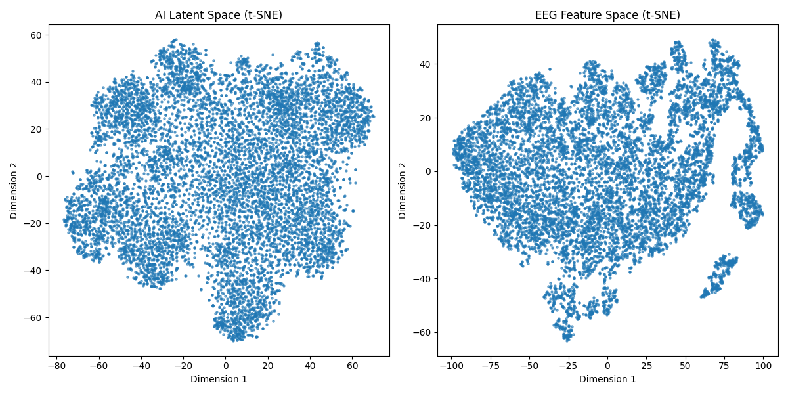

# CIFAR-10 Latent Space vs EEG Brain Latent Space

## Overview
This document provides a comprehensive analysis comparing the latent space from a pre-trained CIFAR-10 AI image model with EEG feature space derived from the occipital cortex (Pz-Oz channel). The goal is to explore potential alignments between artificial latent spaces and biological brain signals.

---

## Key Observations

### 1. **t-SNE Visualization (Spatial Organization)**
- **AI Latent Space**:
  - Uniform and dense clustering.
  - Represents visual features in continuous, well-separated manifolds.

- **EEG Feature Space**:
  - Displays distinct substructures and "tendrils," suggesting complex, dynamic clustering.
  - Likely reflects transitions between brain states or visual processing modes.

### 2. **Canonical Correlation Analysis (CCA)**
- **Top Correlations**:
  - Component 1: **0.140**
  - Component 2: **0.130**
  - Gradual decline to ~0.10 in lower components.
- **Interpretation**:
  - Weak but consistent correlations suggest **shared structure** between AI visual latent space and EEG brain signals.
  - Alignment is strongest in dominant dimensions.

### 3. **Cosine Similarity**
- **Average Maximum Cosine Similarity**: **0.343**
- **Meaning**:
  - Shows measurable overlap in vector alignment between the two spaces.
  - Indicates partial alignment in how visual features are organized.

### 4. **Earth Mover's Distance (EMD)**
- **EMD Distribution Across Dimensions**:
  - Dimension 1: **8.58**
  - Dimension 2: **5.24**
  - Gradual decline to ~0.67 in later dimensions.

- **Average EMD Across Dimensions**: **1.402**
- **Interpretation**:
  - Higher EMD in early dimensions indicates significant divergence in dominant structures.
  - Lower EMD in middle-to-lower dimensions suggests subtle shared features.

### 5. **General Interpretation**
- AI latent space captures clean visual feature organization.
- EEG feature space, particularly from Pz-Oz, reflects:
  - Visual cortex activity.
  - Mixed signals from other brain processes.
  - Complex, dynamic clustering patterns.
- Despite differences, shared structure exists in deeper dimensions, hinting at latent visual features in EEG signals.

---

## Visual Results

### t-SNE Comparison
| AI Latent Space (CIFAR-10) | EEG Feature Space (Pz-Oz Channel) |
|:-------------------------:|:-------------------------------:|
|  |  |

---

## Hypotheses
1. **Dominant Structure Differences**:
   - AI latent space is optimized for visual feature separation.
   - EEG space mixes visual and non-visual neural processes.

2. **Shared Features in Deeper Dimensions**:
   - Lower EMD and consistent correlations suggest hidden alignment in subtle patterns.

3. **Tendrils in EEG t-SNE**:
   - Could represent transitions between brain states or specific visual cortex activity.

---

## Recommendations for Next Steps

### 1. **Pair EEG with Visual Stimuli**
- Collect EEG data while presenting known visual inputs (e.g., images).
- Train supervised models to align brain signals with AI latent space representations.

### 2. **Frequency Band Analysis**
- Decompose EEG signals into frequency bands:
  - Alpha, beta, and gamma oscillations are relevant for visual cortex activity.

### 3. **Dimensionality Reduction**
- Use advanced techniques like **UMAP** or train autoencoders to refine latent features.

### 4. **Dynamic Analysis**
- Explore time-series evolution of EEG features and compare with AI latent transitions.

### 5. **Clustering Analysis**
- Identify distinct sub-clusters within EEG tendrils to uncover specific brain states.

---

## Final Thoughts
The results reveal partial but significant alignment between **AI visual latent space** and **EEG brain latent space**. This hints at a universal organization of visual information processing across artificial and biological systems. While weak without direct mappings, these findings open up pathways for future research into brain-AI representations.

---

### Next Steps
- **Refine EEG preprocessing** to isolate visual cortex signals.
- **Supervised Training** with labeled visual stimuli.
- Explore **cross-space mappings** using supervised or unsupervised methods.

